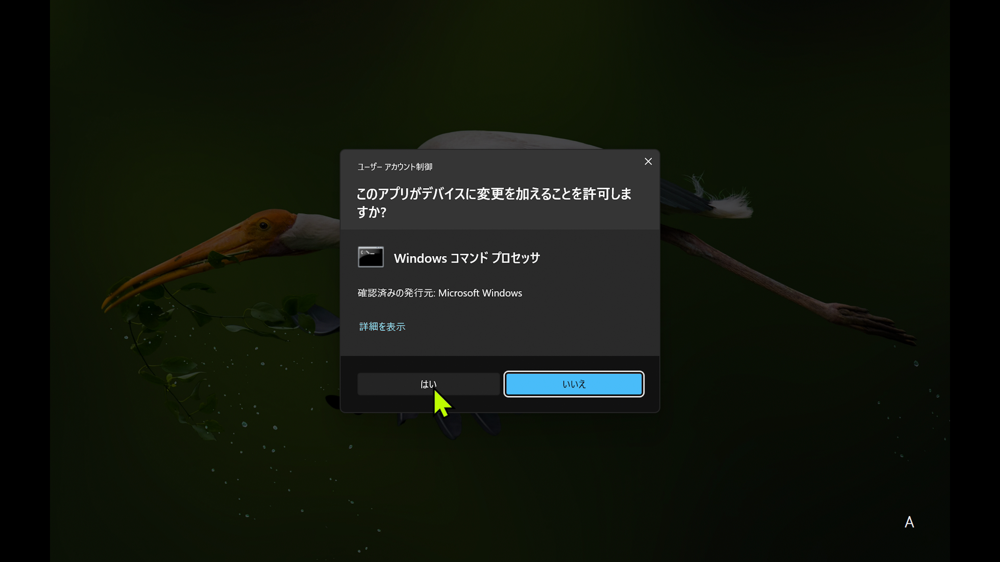

# CH552-SERIAL HID Bridge

[CH552-SERIAL](https://booth.pm/ja/items/4326008) を、シリアル通信で操作できる USB キーボード・マウスにするファームウェアと Windows 用コマンドです。Codex などのエージェントが同じ PC の画面を見ながら操作する用途を想定しています。CH552 の USB-A 側が入力デバイス、CH340 の USB-C 側が操作コマンド用のシリアルポートになります。

Codex の Computer Use から Windows の UAC 確認画面をクリックできない場合、この構成では物理 USB HID として入力し、別途キャプチャボードで表示を確認できます。**このPCで、UAC の「はい」を CH552 経由のマウスでクリックし、起動した処理が High Mandatory Level（`S-1-16-12288`）で動いたことを確認しました。**



*実機で「はい」をクリックする直前のキャプチャ。クリック後に起動した処理の整合性レベルを確認しました。*

接続は 1 台の Windows PC 内で完結します。PC の USB-C 接続から CH340 にコマンドを送り、基板内の UART を経由して CH552 が USB-A 接続から同じ PC に入力します。映像確認が必要な場合は、PC の映像出力をキャプチャボードに入力し、そのキャプチャボードも PC に接続します。映像経路は任意ですが、UAC 画面を見て操作する用途では必要です。

## 必要なもの

- CH552-SERIAL 基板と USB-A / USB-C の接続。両方を操作対象 PC に接続します。
- Windows と Windows PowerShell。動作確認は Windows 11 で実施しました。
- 画面を確認する場合はキャプチャボードと FFmpeg。画面取得は DirectShow のデバイス名を指定します。実機検証には Cam Link 4K を使いました。
- ファームウェア書き込み時のみ、Python 3、`pyusb`、`libusb`、[Zadig](https://zadig.akeo.ie/) が必要です。

## 導入

1. 基板から USB-A と USB-C を両方抜き、10 秒待ちます。基板のスイッチを押したまま USB-A **だけ**を接続し、スイッチを離します。ブートローダーの USB ID は `4348:55E0` です。
2. USB-C は抜いたまま、Zadig で **`4348:55E0` にだけ WinUSB** を割り当てます。USB-C 側の CH340（`1A86:7523`）は書き込み対象ではありません。
3. Python の依存を入れ、同梱のファームウェアを書き込みます。

```powershell
python -m pip install pyusb libusb
python .\flash_when_ready.py
```

`flash_when_ready.py` は `4348:55E0` を最大 2 分待ち、[dist/SerialHidBridge.bin](dist/SerialHidBridge.bin) を書き込んで照合します。成功後、デバイスマネージャーで USB キーボードとマウスが増えたら USB-C を接続します。まだ USB ハードウェア ID `4348:55E0` が表示される場合は、USB-A を一度抜き、スイッチを押さずに挿し直してから USB-C を接続してください。書き込みには [chprog](https://github.com/wagiminator/MCU-Flash-Tools) を同梱しています。

## 操作

デバイスマネージャーで CH340 の COM 番号を調べてください。以下は実機で使った `COM5` の例です。

Codex から使う場合は、このリポジトリを作業場所として開き、[AGENTS.md](AGENTS.md) の手順でコマンドを実行します。これは通常の Computer Use 操作に加えて使うシリアル HID 経路です。COM 番号とキャプチャデバイス名は、その PC に合わせて指定します。

```powershell
powershell -NoProfile -ExecutionPolicy Bypass -File .\control.ps1 -Action ping -Port COM5
powershell -NoProfile -ExecutionPolicy Bypass -File .\control.ps1 -Action combo -Keys WIN+R -Port COM5
powershell -NoProfile -ExecutionPolicy Bypass -File .\control.ps1 -Action text -Text 'abc 123' -Port COM5
powershell -NoProfile -ExecutionPolicy Bypass -File .\control.ps1 -Action move -X 100 -Y 50 -Port COM5
powershell -NoProfile -ExecutionPolicy Bypass -File .\control.ps1 -Action click -Button left -Port COM5
powershell -NoProfile -ExecutionPolicy Bypass -File .\control.ps1 -Action key -Key ESC -Port COM5
powershell -NoProfile -ExecutionPolicy Bypass -File .\control.ps1 -Action release -Port COM5
```

`key`、`keydown`、`keyup`、`combo`、`text`、`move`、`click`、`mousedown`、`mouseup`、`scroll`、`release` に対応します。`text` は英字・数字・空白・改行向けです。その他のキーは `-Key` に HID Usage ID を 16 進数で指定できます（例: `-Key 0x2B` は Tab）。マウス移動は相対値で、Windows のポインター加速により画面上の移動量が変わります。

キャプチャボードがある場合は、FFmpeg が使える状態で次のように取得できます。

```powershell
powershell -NoProfile -ExecutionPolicy Bypass -File .\control.ps1 -Action capture -CaptureDevice 'Cam Link 4K' -Output .\capture.png
```

UAC を含む重要な画面では、取得した映像を確認してから操作してください。入力を止めるには `release` を送るか、CH552 の USB-A を抜きます。ファームウェアも 5 秒間コマンドがなければ保持中のキーとボタンを離します。

### UAC をキーボードで承認する

この PC の管理者アカウント向け UAC では、最初に「いいえ」にフォーカスがありました。キャプチャでアプリと発行元を確認した後、`LEFT` で「はい」にフォーカスを移し、再度キャプチャで白いフォーカス枠を確認してから `ENTER` を送れます。

```powershell
powershell -NoProfile -ExecutionPolicy Bypass -File .\control.ps1 -Action key -Key LEFT -Port COM5
powershell -NoProfile -ExecutionPolicy Bypass -File .\control.ps1 -Action capture -CaptureDevice 'Cam Link 4K' -Output .\output\uac-selected.png
powershell -NoProfile -ExecutionPolicy Bypass -File .\control.ps1 -Action key -Key ENTER -Port COM5
```

実機ではこの方法で起動した処理が High Mandatory Level（`S-1-16-12288`）になりました。「はい」が最初から選ばれている場合や選択状態が不明な場合は、画面を確認して操作を調整してください。標準ユーザーの資格情報入力型 UAC は未検証です。

### Jev に通常画面のボタンを選ばせる（試作）

`jev_hid.py` は Windows UI Automation から前面ウィンドウの有効なボタンを読み、TypeSafe Jev に目的に合うボタンを選ばせ、CH552 のマウス入力でクリックします。UAC の保護された画面には使えません。前面ウィンドウ名とボタン名が設定済みの Jev プロバイダーに送信されるため、画面内容が適切な場合に使用してください。

```powershell
python -m venv .venv
.\.venv\Scripts\python.exe -m pip install -r requirements-jev.txt
.\.venv\Scripts\python.exe .\jev_hid.py --goal 'Close the Run dialog without launching anything'
.\.venv\Scripts\python.exe .\jev_hid.py --goal 'Close the Run dialog without launching anything' --execute
```

Jev 実行時は `--execute` を省くと予測のみ、付けるとクリックします。この PC では「ファイル名を指定して実行」の「キャンセル」を Jev が選び、CH552 がクリックしてダイアログを閉じることを確認しました。用途は名前の付いた通常のボタンに限られ、テキスト入力や複雑な画面操作は未実装です。

## 構成と検証範囲

- `firmware/SerialHidBridge/`: CH552 用ファームウェア。CH55xDuino の HID キーボード・マウス例を基にしています。UART0 と UART1 の両方を 9600 bps、8N1 で受け付けます。
- `control.ps1`: CH340 にコマンドを送る Windows PowerShell スクリプト。シリアルポートを開き直すたびに接続を確認します。
- `flash_when_ready.py`: ブートローダー待機、書き込み、照合。
- `dist/`: このPCで書き込みと照合に成功したファームウェア。再ビルド方法は [BUILD.md](BUILD.md) を参照してください。

このPCでは、シリアル ping、文字入力、キー操作、マウス移動とクリック、キャプチャ映像からの UAC 確認、CH552 による「はい」のクリック、昇格後の整合性レベルを確認しました。UAC は管理者アカウントの承認型画面でした。標準ユーザーの資格情報入力型 UAC は未検証です。ポインター加速や画面解像度が違う場合は、キャプチャを見て位置を合わせ直す必要があります。使った Codex は GPT-6 Sol です。GPT-6 Astra、および他の PC、キャプチャボード、キーボード配列での動作は未検証です。

## ライセンスと開発支援

本リポジトリのコードは LGPL-2.1 に従います。CH55xDuino 由来の HID コードは [そのライセンス](licenses/CH55xDuino-LGPL-2.1.txt)、同梱の `third_party/chprog.py` は [MIT ライセンス](third_party/chprog-LICENSE.txt) です。

実装と Windows 実機検証には Codex の **GPT-6 Sol（Medium／中）**、公開文面の校正には **Gemini 3.8 Flash（High）** を使用しました。機能の確認結果はキャプチャ映像、シリアル応答、Windows の整合性レベル表示に基づいています。
